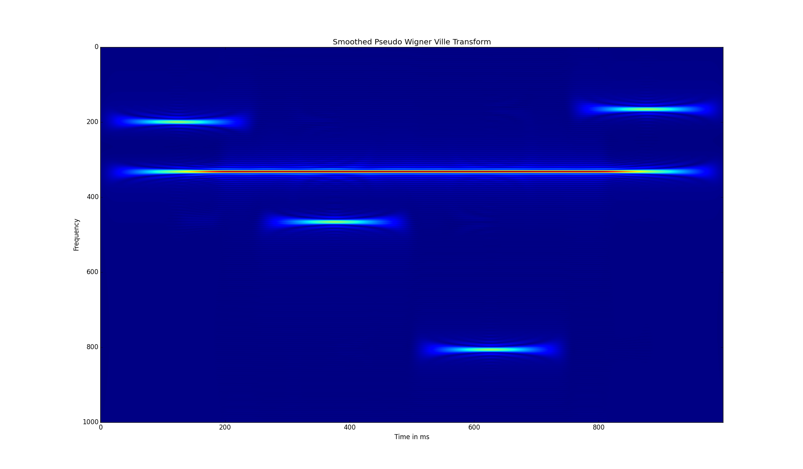

wignerVille.jl
==============

An implementation of the Wigner-Ville transform in julia
ported from c-code. 

This module is a straight-forward implementation of:

1. The basic Wigner-Ville (WV) transform  
2. The pseudo-WV (PWV)  
3. And the smoothed-PWV (SPWV)

in the programming language julia.

Initial stage!!!! The subfunctions are working correctly but are 
un-optimised. No documentation yet.

The final version uses open.blas and fftw bindings to calculate 
the spwd in parallel.

The image shows the SPWV of a synthetic signal plotted with 
[PyPlot](http://github.com/stevengj/PyPlot.jl). 

